[](https://npmjs.org/package/dx-scanner)
[](https://travis-ci.org/DXHeroes/dx-scanner)


[](https://npmjs.org/package/dx-scanner)

[](#contributors-)
[](LICENSE)
[](https://oclif.io)

[](https://twitter.com/DX_Heroes)

# DX Scanner

DX Scanner is an open source CLI tool that allows you to “measure” Developer Experience directly based on your source code. DX Scanner recommends practices that can help you with improving your product development.




## What language is supported?

Language | Supported
------------ | -------------
JavaScript/TypeScript | ✅
Java | 🏁
Python | 🚧
PHP | 🚧
C++ | 🚧
C# | 🚧
Ruby | 🚧

## Getting Started 🏁

### Installation

- with NPM
  
  ```npm install -g dx-scanner``` 
- with Yarn 
  
  ```yarn global add dx-scanner```

### Usage

**Scan repository**
```
dx-scanner https://github.com/DXHeroes/dx-scanner
```
**Scan local path**
```
dx-scanner ~/my-project
```

**All options**

```
dx-scanner [path]
```

**Aliases**
```
dx-scanner [path]

dxscanner [path]

dxs [path]
```
## Flags Usage 🏳️
**Use flags to let DX Scanner do what you want!**

Insert your auth code if your repo is private.
```
dxs -a=AUTH_CODE

dxs [path] -a=AUTH_CODE
```
Insert impact on which dxs command should fail. See possible impacts below. If you use *small* impact dxs command fail also if you don't practice some practices with medium or high impact.
```
dxs --fail=PRACTICE_IMPACT
```
Use *all* if you want dxs command fail whenever you have some not practicing practices.
```
dxs --fail=all
```
Use *j* flag if you want the report in JSON. 
```
dxs -j
```

## Configuration ⚙️
Add ```dxscannerrc.*``` config file to change default configuration. It can be a ```.json```, ```.yml```, and even a dotfile!

**Practices**  
You can switch off practices you do not want to scan or change its impact. Use the id of the practice.

Possible impact:
```
high

medium

small

hint

off
```

Example :
```
{
    "practices": {
        "JavaScript.GitignoreCorrectlySet": "medium",
        "JavaScript.LoggerUsed": "off"
    }
}
```

## Score Counting 💯
Every practice impact has a value which is used for counting overall DX Score.

```
high = 100 points

medium = 75 points

small = 50 points 

hint = 25 points
```

If you switched off some practices they are not included in counting (0 points).

## Contributing 👩‍💻 👨‍💻
Feel free to contribute to our DX Scanner. Please follow the [Contribution Guide](CONTRIBUTING.md).

## License 📝

The DX Scanner open source project is licensed under the [MIT](LICENSE).

## Contributors ✨

Many thanks to these wonderful people ([emoji key](https://allcontributors.org/docs/en/emoji-key)):

<!-- ALL-CONTRIBUTORS-LIST:START - Do not remove or modify this section -->
<!-- prettier-ignore-start -->
<!-- markdownlint-disable -->
<table>
  <tr>
    <td align="center"><a href="https://github.com/prokopsimek"><br /><sub><b>Prokop Simek</b></sub></a><br /><a href="https://github.com/DXHeroes/dx-scanner/commits?author=prokopsimek" title="Code">💻</a> <a href="#maintenance-prokopsimek" title="Maintenance">🚧</a></td>
    <td align="center"><a href="https://github.com/adelkahomolova"><br /><sub><b>adelkah</b></sub></a><br /><a href="https://github.com/DXHeroes/dx-scanner/commits?author=adelkahomolova" title="Code">💻</a> <a href="#maintenance-adelkahomolova" title="Maintenance">🚧</a></td>
    <td align="center"><a href="https://github.com/radektheloner"><br /><sub><b>Radek Holý</b></sub></a><br /><a href="https://github.com/DXHeroes/dx-scanner/commits?author=radektheloner" title="Code">💻</a></td>
    <td align="center"><a href="http://www.applifting.cz"><br /><sub><b>Vratislav Kalenda</b></sub></a><br /><a href="https://github.com/DXHeroes/dx-scanner/commits?author=Vratislav" title="Code">💻</a> <a href="#ideas-Vratislav" title="Ideas, Planning, & Feedback">🤔</a></td>
    <td align="center"><a href="http://www.petrvnenk.com"><br /><sub><b>Petr Vnenk</b></sub></a><br /><a href="https://github.com/DXHeroes/dx-scanner/commits?author=vnenkpet" title="Code">💻</a></td>
  </tr>
</table>

<!-- markdownlint-enable -->
<!-- prettier-ignore-end -->
<!-- ALL-CONTRIBUTORS-LIST:END -->

This project follows the [all-contributors](https://github.com/all-contributors/all-contributors) specification. Any kind of contributions are welcome!
